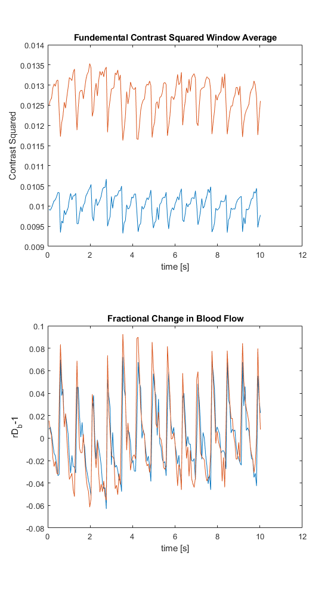

# Multi-channel SCOS data processing
Communications Biology 2025 - Mapping human cerebral blood flow with high-density, multi-channel speckle contrast optical spectroscopy

We have created a data analysis pipeline for multi-channel SCOS under photon starved conditions. This repository contains:

SCOS control board C++ code to perform temporal multiplexing using a galvanometer for multi-channel SCOS data aquisition (./Arduino).
An example preprocessing script to demonstrate the preprocessing pipeline (./ Analysis and Preprocessing).
An example analysis script to demonstrate the analysis pipeline (./ Analysis and Preprocessing).

To run the code: 

Clone this repository onto a folder.
Clone the fbLSC-library github repository (https://github.com/BUNPC/fbLSC-library). Add it's directory to the path using Matlab's "pathtool" GUI. The analysis and preprocessing scripts rely on functions in the fbLSC-library, and the scripts will not run if Matlab cannot access those functions.
Download the raw camera frame data from Zenodo (10.5281/zenodo.15857987). Ensure that the folder hierarchy matches the structure on Zenodo. The preprocessing script will save files to the correct directory to be accessed by the analysis code. 

Run preprocess_script_example.m
Run analyze_preprocessed_local_example.m

The preprocess_script_example.m outputs:

Preprocessed data files (section1_preprocessed.mat, dark_preprocessed.mat) in ./Analysis and Preprocessing/preprocessed/run1/camera2
Raw standard deviation and mean intensity time courses for each 7x7 pixel window.

Indexing and processing metadata to simplify bookkeeping and aid downstream analysis.

The analyze_preprocessed_local_example.m outputs:

Analyzed data files(run1camera2.mat) in ./Analysis and Preprocesssing/analyzed/run1
The window averaged mean intensity time course separated by source. 

The window averaged raw contrast squared before noise subtraction.

The window averaged contrast squared due to read noise, shot noise, and spatial heterogineity.

The fundemental contrast squared after noise correction, which is used to calculate rDb-1.

Indexing and processing metadata.

For any issue reporting or suggestions, please contact Alexander Howard, ach12345@bu.edu

